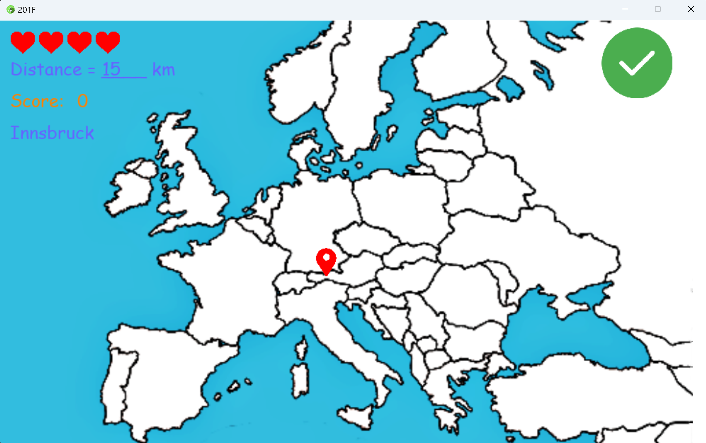
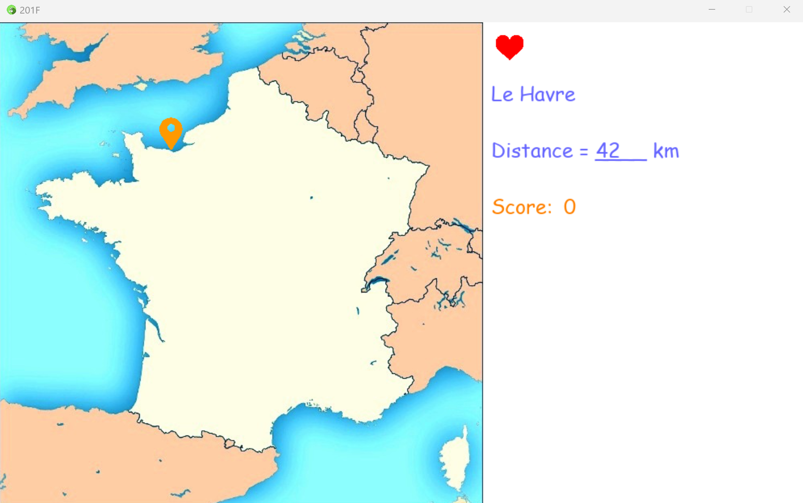

# 201 Farehein

201 Farehein est une parodie du célèbre jeu de mots "94 degrees". Explorez un monde rempli de défis, de questions hilarantes et de réponses surprenantes. Testez vos connaissances géographiques tout en vous amusant !

## Comment jouer
1. Téléchargez et installez l'application 201 Farehein sur votre appareil.
2. Lancez le script main.py
3. Enjoy.

### Captures d'écran

